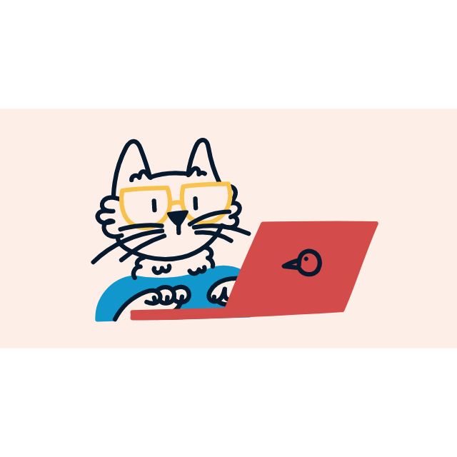

<p align="center">
  
</p>

<h1 align="center">Hey 👋, I'm Shivpujan</h1>

<p align="center">
  
</p>

<p align="center">
  <a href="https://www.codebyshiv.com/">
    
  </a>
  <a href="https://www.linkedin.com/in/shivpujan/">
    
  </a>
</p>

<p align="center">
  
</p>

---

## 🧠 About Me

- 🏙️ Based in **Mumbai** — always exploring  
- 💼 Product Engineer at **Shuru**  
- ⚛️ Focused on **performance + scalable UI**  
- 🚶‍♂️ Walking 12–15 km like it’s normal  
- 🌮 Street food + side quests = happiness  
- 🧩 Leveling up **communication & system design**

---

## ⚒️ Tech Stack

<p align="center">
  
</p>

---

## 🧑‍💻 Dev Mode

```js
const shivpujan = {
  code: "clean + performant",
  mindset: "optimize first, regret later",
  bugFixing: "console.log → enlightenment",
  currentFocus: ["Search Optimization", "UI Performance", "React Native"]
};
